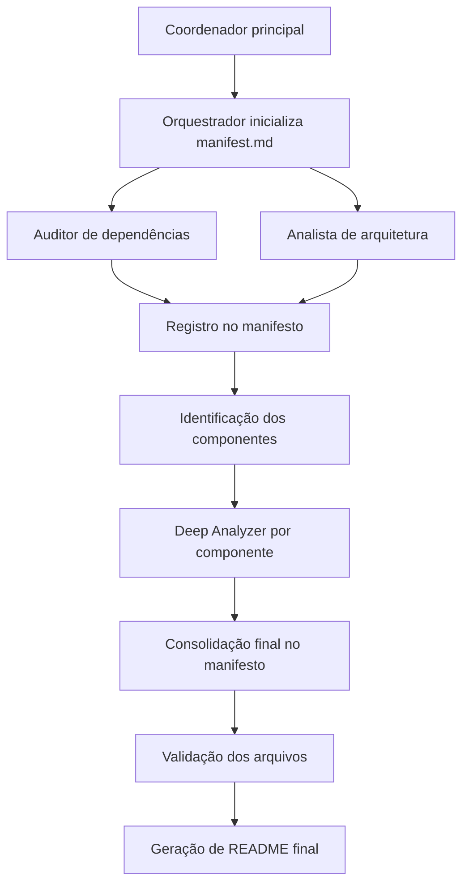

# Prompts e Workflow de Agentes

## Visão geral

Este material mostra como estruturar prompts para agentes de IA de forma mais previsível, reduzindo ambiguidade e aumentando a qualidade do resultado. O exemplo principal é um agente de auditoria de dependências, mas a lógica pode ser reutilizada em outros contextos.

Este arquivo tem finalidade didática. Ele organiza os conceitos do capítulo para estudo, revisão e entendimento da lógica do workflow.
Para instruções operacionais e regras de execução dos agentes desta pasta, consulte `AGENTS.md`.
Para contexto histórico, memória editorial e observações complementares de workflow preservadas do `AGENTS.md` anterior, consulte `workflow-e-historico.md`.

A ideia central é simples: não existe um prompt universal, mas existe uma forma melhor de organizar instruções para que o agente entenda com clareza:

- Quem ele é
- O que deve fazer
- O que não deve fazer
- Quais entradas pode usar
- Qual formato de saída deve gerar
- Quais critérios precisa seguir
- Como lidar com ambiguidades e erros

## Como usar este material

Use este arquivo para:

- Entender a lógica de construção de prompts
- Revisar a separação de responsabilidades entre agentes
- Relacionar conceitos com os exemplos concretos da pasta
- Estudar o fluxo multiagente em linguagem mais explicativa

Use `AGENTS.md` para:

- Obter as regras operacionais da pasta
- Entender o contrato de execução dos agentes
- Verificar restrições, fases e disciplina de outputs
- Saber qual arquivo deve ser seguido na prática por um coordenador de agentes

Use `workflow-e-historico.md` para:

- Consultar contexto histórico do capítulo
- Rever formulações anteriores do workflow
- Entender a memória editorial da reorganização dos arquivos

## Artefatos desta pasta

Esta pasta não contém apenas a transcrição reorganizada. Ela também inclui os artefatos práticos citados ao longo do material, que ajudam a conectar a explicação conceitual com exemplos reais de especificação:

| Artefato | Papel no capítulo |
| --- | --- |
| `AGENTS.md` | Contrato operacional da pasta para execução do workflow |
| `workflow-e-historico.md` | Registro histórico e contexto complementar do workflow |
| `agents/dependency-auditor.md` | Exemplo completo de agente especialista para auditoria de dependências |
| `agents/architectural-analyzer.md` | Exemplo de agente para análise arquitetural de alto nível |
| `agents/component-deep-analyzer.md` | Exemplo de agente para análise profunda de componentes individuais |
| `agents/orchestrator.md` | Especificação do agente orquestrador responsável por `MANIFEST.md` |
| `commands/run-project-state-full-report.md` | Comando que encadeia as fases e operacionaliza o workflow multiagente |

Na prática, estes arquivos materializam os exemplos mencionados no conteúdo:

- O exemplo de auditoria de dependências corresponde ao agente `dependency-auditor`.
- A análise de arquitetura e a análise por componente aparecem como agentes separados, reforçando a separação de responsabilidades.
- O papel do orquestrador e o fluxo por fases aparecem formalizados no comando `run-project-state-full-report`.
- O arquivo `AGENTS.md` concentra a versão operacional das regras descritas aqui em formato de estudo.
- O arquivo `workflow-e-historico.md` preserva o contexto histórico e observações complementares que não precisam ficar no arquivo operacional.

## Estrutura-base de um bom prompt

Ao montar um prompt mais robusto, a estrutura sugerida inclui:

| Elemento | Função |
| --- | --- |
| Persona e escopo | Define o perfil do agente e o limite de atuação |
| Objetivo | Explica claramente o resultado esperado |
| Entrada | Especifica quais dados o agente pode usar |
| Saída | Define o formato do resultado |
| Critérios | Estabelece regras de validação e análise |
| Ambiguidades e pressupostos | Orienta como agir diante de cenários incertos |
| Instruções negativas | Restringe comportamentos indesejados |
| Tratamento de erro | Define como responder quando a tarefa não puder ser executada |
| Workflow | Resume o passo a passo operacional esperado |

O ponto mais importante é a clareza. Muitas vezes, a dificuldade em escrever um bom prompt não está na IA, mas em não sabermos exatamente o que queremos pedir.

## Exemplo: agente de auditoria de dependências

O exemplo discutido nesta seção está representado de forma concreta no arquivo `agents/dependency-auditor.md`, que transforma a estrutura conceitual do vídeo em uma especificação operacional de agente.

### Persona e escopo

No exemplo apresentado, o agente é descrito como:

- `senior software engineer`
- Especialista em gerenciamento de dependências
- Capaz de analisar projetos com múltiplas linguagens e ecossistemas

O escopo também é delimitado com firmeza:

- O agente deve apenas analisar e gerar um relatório
- Ele não deve modificar o projeto
- Ele não deve executar upgrades
- Ele não deve alterar o codebase em nenhuma etapa

Essa restrição explícita reduz o risco de a IA extrapolar o pedido.

### Objetivo

O objetivo do agente precisa ser descrito de forma específica. No caso da auditoria, ele deve:

- Identificar dependências desatualizadas
- Detectar bibliotecas depreciadas ou legacy
- Verificar vulnerabilidades conhecidas
- Apontar pacotes sem manutenção recente
- Avaliar compatibilidade de licenças
- Destacar riscos de manutenção
- Gerar recomendações estruturadas sem alterar código

Quanto mais claro o objetivo, menor a chance de respostas vagas ou desalinhadas.

### Entradas esperadas

As entradas incluem principalmente arquivos de manifesto e lockfiles, por exemplo:

- `package.json`
- `package-lock.json`
- `pnpm-lock.yaml`
- `yarn.lock`
- `requirements.txt`
- Arquivos equivalentes de ecossistemas como Rust e Go

Além disso, o agente pode:

- Detectar linguagem, framework e ferramentas do repositório
- Receber instruções opcionais do usuário, como foco em segurança ou licenciamento
- Pedir confirmação se não encontrar arquivos suficientes para prosseguir

### Formato de saída

O relatório esperado deve ser explicitamente descrito, por exemplo em Markdown com seções como:

- `Summary`
- `Critical Issues`
- Tabela de dependências com versão atual, versão mais recente e status
- Análise de risco
- Seção de dependências não verificadas, somente se houver
- Análise de arquivos críticos
- Notas de integração
- Plano de ação

Também é útil especificar detalhes do formato, como:

- Usar caminhos relativos em vez de caminhos absolutos
- Não criar seções vazias desnecessárias
- Perguntar ao usuário onde salvar o relatório se o caminho não tiver sido informado

### Critérios de análise

Os critérios tornam o prompt mais verificável. Exemplos:

- Identificar todos os package managers encontrados
- Catalogar apenas dependências diretas
- Ignorar dependências transitivas nesse relatório
- Comparar cada dependência com a última versão estável apenas para reporte
- Sinalizar pacotes depreciados
- Marcar bibliotecas sem manutenção há mais de um ano
- Verificar licenças e vulnerabilidades
- Classificar riscos em `critical`, `high`, `medium` e `low`
- Destacar `single points of failure`
- Apontar possíveis `breaking changes`

Quando disponível, o agente também pode usar ferramentas externas, como MCP servers, para validar versões, manutenção e vulnerabilidades.

### Ambiguidades e pressupostos

O prompt pode antecipar cenários ambíguos, por exemplo:

- Se houver múltiplos ecossistemas no mesmo diretório, auditar separadamente
- Se faltarem versões ou lockfiles, registrar a limitação e o nível de confiança
- Se o usuário não especificar uma pasta, auditar o projeto inteiro
- Se especificar uma pasta, limitar a auditoria a ela

Esse tipo de instrução evita decisões implícitas mal interpretadas.

### Instruções negativas

Algumas proibições importantes foram reforçadas no exemplo:

- Não modificar o codebase
- Não sugerir edição direta de código
- Não executar upgrades
- Não inventar CVEs
- Não usar linguagem vaga como "provavelmente seguro"
- Não usar emojis ou caracteres estilizados
- Não estimar tempo de correção em horas ou dias

Essas instruções existem porque muitos modelos tendem a preencher lacunas com suposições ou exagerar no estilo.

### Tratamento de erro

Se o agente não conseguir executar a auditoria, ele deve responder de maneira estruturada, deixando claro:

- Status de erro
- Motivo da falha
- Quais arquivos ou permissões estão faltando
- Próximos passos para permitir a execução

Exemplos de causas:

- Nenhum arquivo de dependência encontrado
- Falta de acesso ao workspace
- Ecossistema não identificado com confiança suficiente

### Workflow resumido

Ao final, o prompt ainda pode trazer um fluxo operacional explícito:

1. Detectar projeto, stack e package managers.
2. Inventariar dependências.
3. Comparar versões.
4. Verificar vulnerabilidades e licenças.
5. Categorizar riscos.
6. Identificar arquivos críticos.
7. Gerar o relatório final no formato definido.

Esse resumo ajuda o agente a entender a ordem esperada de execução.

### Onde isso aparece na pasta

Os elementos descritos acima aparecem de forma explícita em `agents/dependency-auditor.md`, incluindo:

- Persona e escopo
- Objetivo
- Inputs
- Output format
- Critérios
- Ambiguidades e pressupostos
- Instruções negativas
- Tratamento de erro
- Workflow

Isso confirma que o material não apenas descreve a estrutura de prompt, mas também traz uma implementação textual completa dela dentro da própria pasta.

## Resultado do prompt

Após apresentar a estrutura, o material discute o resultado gerado pelo prompt na prática. A ênfase não está em uma ferramenta específica, mas em como a qualidade do prompt afeta o resultado, independentemente de estar sendo usado no Claude Code, Gemini, Codex ou outra solução.

A principal mensagem é:

- Prompts melhores não garantem perfeição
- Prompts melhores aumentam a probabilidade de saídas úteis, organizadas e auditáveis

Dentro desta pasta, o resultado prático não aparece como um relatório executado específico, mas como uma formalização dos agentes e do comando que geram esses relatórios. Em outras palavras:

- `agents/dependency-auditor.md` define como o relatório de dependências deve ser produzido
- `agents/architectural-analyzer.md` define como o relatório de arquitetura deve ser produzido
- `agents/component-deep-analyzer.md` define como os relatórios por componente devem ser produzidos
- `commands/run-project-state-full-report.md` define como tudo isso deve ser executado em sequência e em paralelo

## Workflow multiagente

Na parte seguinte, o material evolui do agente único para um workflow com vários agentes especializados coordenados por um agente principal.

### Papéis no fluxo

Existem três papéis principais:

| Papel | Responsabilidade |
| --- | --- |
| Coordenador principal | Inicia tarefas, distribui contexto e chama os agentes |
| Agentes especialistas | Executam análises específicas |
| Orquestrador | Mantém o manifesto e registra o estado do processo |

Esses papéis estão diretamente refletidos nos arquivos da pasta:

- `commands/run-project-state-full-report.md` assume o papel de coordenador do fluxo
- `agents/dependency-auditor.md`, `agents/architectural-analyzer.md` e `agents/component-deep-analyzer.md` representam os especialistas
- `agents/orchestrator.md` formaliza o agente que mantém o `MANIFEST.md`

Um ponto essencial é a separação de responsabilidades:

- O coordenador decide quais agentes rodar e quando
- O orquestrador não chama subagentes
- Os especialistas não coordenam o workflow

### Regras importantes do fluxo

Nesta seção, o objetivo é explicar a lógica do fluxo. A formulação normativa e executável dessas regras fica centralizada em `AGENTS.md` e em `commands/run-project-state-full-report.md`.

- Cada agente deve ser invocado em uma tarefa separada
- O orquestrador não deve criar outros agentes
- Toda comunicação passa pelo coordenador
- O manifesto deve ser atualizado para refletir o progresso do workflow
- Relatórios só podem ser salvos nos diretórios autorizados
- Não devem ser criadas pastas extras sem especificação

Essas regras aparecem repetidamente em dois lugares da pasta:

- `agents/orchestrator.md`, que reforça política de caminhos, registro e integridade
- `commands/run-project-state-full-report.md`, que transforma essas regras em instruções executáveis para o coordenador

### Fases do workflow

#### Fase 1: preparação

O orquestrador:

- Entende os caminhos de entrada e saída
- Respeita parâmetros como `--projectfolder`, `--outputfolder` e `--ignore-folders`
- Cria apenas os diretórios exigidos
- Inicializa o `manifest.md`

O manifesto deve registrar, no mínimo:

- Título
- Caminho absoluto
- Agente responsável
- Timestamp

Essa fase está formalizada em `agents/orchestrator.md` e também no bloco `Phase 1` de `commands/run-project-state-full-report.md`.

#### Fase 2: relatórios principais em paralelo

Dois agentes podem ser executados em paralelo:

- Auditor de dependências
- Analista de arquitetura

O auditor deve validar:

- Versões
- Manutenção dos pacotes
- Vulnerabilidades

O analista de arquitetura deve gerar:

- Visão estrutural do sistema
- Componentes relevantes
- Artefatos que serão usados na fase seguinte

Somente o orquestrador registra a conclusão dessas tarefas no `manifest.md`.

Na pasta, essa separação está distribuída assim:

- `agents/dependency-auditor.md`: relatório de dependências
- `agents/architectural-analyzer.md`: relatório de arquitetura
- `agents/orchestrator.md`: registro e consolidação em `MANIFEST.md`
- `commands/run-project-state-full-report.md`: instrução explícita para rodar dependências e arquitetura em paralelo

#### Fase 3: análise profunda por componente

Com base no relatório de arquitetura, o coordenador deve:

- Identificar todos os componentes listados
- Iniciar um agente separado para cada componente
- Executar essas tarefas em paralelo
- Garantir cobertura de 100%

Se o relatório listar 10 componentes, devem ser executados 10 agentes, um para cada componente.

Depois da execução, é necessário:

- Reabrir o relatório de arquitetura
- Revisar a lista de componentes
- Verificar se todos receberam relatório específico
- Executar novas análises se algo tiver ficado faltando

Também foi sugerido usar instruções como `ultrathink` para forçar maior rigor na checagem de duplicações e cobertura.

Esse comportamento é descrito operacionalmente em `commands/run-project-state-full-report.md` e depende do insumo gerado por `agents/architectural-analyzer.md`, que é o arquivo responsável por listar os componentes que alimentarão `agents/component-deep-analyzer.md`.

#### Fase 4: consolidação

O orquestrador reúne todos os relatórios gerados e finaliza o `manifest.md`, consolidando:

- Relatórios produzidos
- Componentes cobertos
- Status das tarefas

Na prática, esta fase corresponde ao retorno do fluxo para `agents/orchestrator.md`, que valida, deduplica e finaliza o `MANIFEST.md`.

#### Fase 5: validação final

O coordenador:

- Lê o manifesto
- Valida a existência dos arquivos
- Gera um `README` final no diretório do orquestrador

Esse `README` serve como índice do material produzido.

Essa etapa aparece de forma explícita em `commands/run-project-state-full-report.md`, que orienta a geração de um README final a partir do `MANIFEST.md`.

## Role Specification do orquestrador

O orquestrador é apresentado como um agente mais simples, mas com papel crítico para o controle do estado do workflow.

Dentro da pasta, essa especificação está concretizada no arquivo `agents/orchestrator.md`.

### Definição do papel

O orquestrador:

- Coordena o registro do trabalho multiagente
- Garante estrutura e auditabilidade
- Mantém o `manifest.md` como fonte única da verdade

Ele não é o coordenador principal. Ele apenas sustenta o controle operacional do processo.

### Responsabilidades centrais

- Inicializar a estrutura do projeto
- Criar e manter o `manifest.md`
- Registrar outputs concluídos
- Rastrear agente responsável, caminho e timestamp
- Garantir que todos os componentes listados tenham cobertura
- Validar e finalizar o manifesto

### Framework operacional

O workflow do orquestrador segue algumas regras:

- Somente ele escreve no `manifest.md`
- Não deve inventar nomes de pastas
- Deve verificar se caminhos existem antes de registrar
- Deve controlar cobertura de componentes
- Deve remover duplicações e validar integridade ao final

### Princípios de decisão

O material destaca alguns princípios úteis:

- `separation of concerns`: cada papel decide apenas o que lhe compete
- `parallel safe recording`: registrar resultados cedo para reduzir riscos operacionais
- `state mínimo necessário`: manter registros objetivos e factuais
- `caminhos determinísticos`: evitar ambiguidades sobre onde estão os arquivos
- `safety over convenience`: rejeitar registros dúbios ou duplicados

### Padrões de comunicação

O orquestrador deve se comunicar apenas com o coordenador principal. Boas práticas citadas:

- Nunca falar diretamente com especialistas
- Retornar atualizações claras e estruturadas
- Informar relatórios gerados, caminhos, agentes e componentes faltantes
- Exigir que o resultado de cada especialista volte ao orquestrador para registro

### Ações proibidas

O orquestrador não deve:

- Gerar múltiplos agentes
- Criar sequências próprias de agentes
- Propor mudanças no código
- Criar recomendações executivas dentro do manifesto
- Estimar horas
- Trabalhar com linguagem vaga

## Template conceitual de `manifest.md`

O manifesto pode conter itens como:

- Nome do projeto
- Gerador
- Caminho do orquestrador
- Reports
- Componentes
- Workflow
- Tasks
- Ideias
- Timestamp por relatório
- Status
- Anotações mínimas

Na prática, ele funciona como um arquivo de estado do workflow.

O template correspondente aparece em duas camadas:

- Conceitualmente em `agents/orchestrator.md`
- Operacionalmente em `AGENTS.md`, que descreve o `MANIFEST.md` como fonte única da verdade do workflow

## Trade-off operacional

O material também discute um trade-off importante:

- Registrar no manifesto após cada tarefa aumenta o controle e a rastreabilidade
- Registrar apenas ao final de um bloco paralelo reduz overhead, mas aumenta o risco de perder estado se a sessão for interrompida

Ou seja, há uma troca entre:

- Mais segurança operacional
- Mais velocidade de execução

## Principais aprendizados

- Prompt engineering é iterativo.
- Estruturas mais claras reduzem ambiguidade.
- Instruções negativas são tão importantes quanto objetivos.
- Workflows multiagente exigem separação rigorosa de responsabilidades.
- Um orquestrador simples pode ser suficiente se o papel estiver bem delimitado.
- Quanto melhor o protocolo entre agentes, maior a chance de execução consistente.

## O que estudar em cada arquivo

Se o objetivo for revisar o capítulo com foco didático, a sequência mais útil é:

1. `prompts-e-workflow-de-agentes.md`
2. `agents/dependency-auditor.md`
3. `agents/orchestrator.md`
4. `commands/run-project-state-full-report.md`
5. `AGENTS.md`
6. `workflow-e-historico.md`

Essa ordem ajuda porque:

- Este arquivo explica a lógica geral
- O `dependency-auditor` mostra uma estrutura de prompt completa
- O `orchestrator` mostra o papel de controle de estado
- O comando mostra a orquestração por fases
- O `AGENTS.md` consolida tudo em formato operacional
- O `workflow-e-historico.md` preserva o pano de fundo histórico do capítulo

## Fluxo resumido

## Pontos ambíguos ou incompletos

- A transcrição repete vários conceitos em momentos diferentes; eles foram consolidados em uma única estrutura.
- Os exemplos práticos citados no conteúdo estão parcialmente representados na própria pasta por meio de `AGENTS.md`, de `workflow-e-historico.md`, dos arquivos em `agents/` e do comando em `commands/`, mesmo quando o vídeo original não reproduz todos os outputs finais.
- O material menciona ferramentas e comportamentos específicos de coordenadores como Claude Code, mas o princípio geral é aplicável a outros ambientes.
