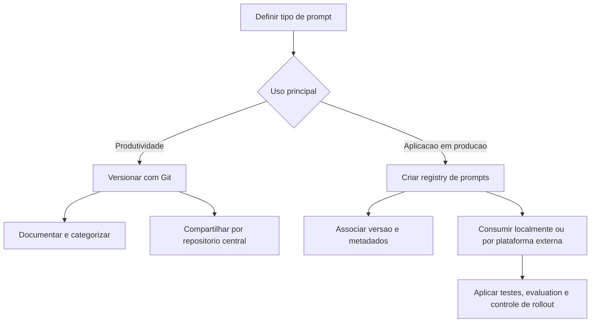

# Gerenciamento e Versionamento de Prompts

## Visão Geral

Este capítulo discute um ponto central da engenharia de prompts: prompt também é software. Isso significa que prompt precisa de organização, histórico, revisão, testes e estratégia de evolução.

A ideia principal é separar dois contextos diferentes:

1. Prompts usados para aumentar a produtividade de desenvolvedores e equipes.
2. Prompts usados dentro de aplicações e agentes que vão para produção.

Embora ambos sejam prompts, a forma de gerenciar, versionar e distribuir cada tipo muda bastante.

## Duas Perspectivas de Versionamento

### 1. Prompts para produtividade

São prompts usados no dia a dia para:

- explorar um codebase;
- planejar tarefas;
- gerar documentação;
- corrigir bugs;
- refatorar código;
- criar testes;
- executar workflows recorrentes, como commit, pull request e code review.

Nesse cenário, o prompt funciona como uma ferramenta de trabalho. Ele afeta diretamente a produtividade da equipe, mas normalmente não altera diretamente o comportamento de um sistema em produção.

### 2. Prompts para aplicações de IA

São prompts incorporados ao software:

- prompts de agentes;
- prompts de sistemas conversacionais;
- prompts usados em fluxos de inferência;
- prompts que definem comportamento de features em produção.

Nesse caso, o prompt é parte crítica do sistema. Alterar um prompt pode mudar o comportamento da aplicação em produção, então o rigor tende a ser maior.

## Princípio Central: Tratar Prompt Como Software

Se prompt é software, então ele deve ter:

- controle de versão;
- histórico de alterações;
- revisão por pares quando fizer sentido;
- testes ou formas de validação;
- documentação mínima;
- critério para promoção entre versões.

Para prompts de equipe, a recomendação central é simples: usar Git e aplicar práticas próximas às já adotadas para código.

## Prompts para Produtividade em Equipe

### Como pensar

Quando um prompt é compartilhado pela equipe, ele deixa de ser um artefato pessoal e passa a ser um ativo colaborativo. Isso muda o processo:

- várias pessoas testam;
- o prompt evolui por iteração;
- o comportamento pode variar conforme o modelo utilizado;
- ajustes deixam de ser puramente individuais.

### Fluxo recomendado

Um fluxo prático para equipe é:

1. Criar ou alterar o prompt.
2. Versionar a mudança.
3. Abrir pull request.
4. Pedir que outras pessoas testem.
5. Fazer review do prompt.
6. Aprovar e promover a nova versão.

### Sobre testes e evaluation

Nem todo prompt pode ser validado com métricas totalmente objetivas. Isso acontece especialmente com prompts voltados à produtividade, porque eles costumam envolver várias iterações e uso mais aberto.

Ainda assim, isso não elimina a necessidade de avaliação. O ponto é que a avaliação pode ser:

- mais subjetiva;
- baseada em cenários de uso;
- guiada por exemplos esperados;
- apoiada por frameworks de evaluation.

## Gestão de Prompts de Uso Geral

### Recomendação de organização

Para prompts mais genéricos, a sugestão é manter um repositório dedicado de prompts. Esse repositório funciona como a fonte principal para materiais reutilizáveis entre projetos e entre pessoas do time.

### O que evitar

Não é recomendável copiar o repositório inteiro de prompts para dentro de cada projeto. Isso pode gerar:

- excesso de arquivos irrelevantes no contexto do projeto;
- ambiguidades para ferramentas de IA ao ler instruções conflitantes;
- duplicação e perda de controle sobre versões.

### Estratégia sugerida

Uma estratégia prática é:

- manter um repositório central de prompts;
- criar uma pasta local no projeto, como `.prompts`;
- usar links simbólicos apenas para os prompts relevantes naquele projeto;
- ignorar esses links no `.gitignore`, quando apropriado.

Essa abordagem reduz ruído e evita espalhar cópias do mesmo prompt em vários lugares.

## Prompts Genéricos vs. Prompts Específicos de Projeto

Essa separação é importante:

| Tipo                              | Onde faz mais sentido ficar    | Exemplo                                                                 |
| --------------------------------- | ------------------------------ | ----------------------------------------------------------------------- |
| Prompt genérico de uso recorrente | Repositório central de prompts | Comandos utilitários, guias de linguagem, prompts de planejamento       |
| Prompt específico de um projeto   | Dentro do próprio projeto      | `AGENTS.md`, `CLAUDE.md`, `CODEX.md`, workflows e instruções do sistema |

Prompts específicos do projeto devem ficar no projeto porque fazem parte do contexto daquele software.

## Documentação do Repositório de Prompts

O repositório de prompts deve ter um `README.md` funcionando como índice categorizado.

Além disso, cada prompt ou conjunto de prompts pode ter sua própria documentação. Uma estrutura simples e útil inclui:

- nome do prompt;
- link para o arquivo principal do prompt;
- objetivo;
- modelos já testados;
- observações gerais;
- pequeno changelog das últimas alterações.

O changelog não é obrigatório, mas ajuda bastante quem está entrando no projeto ou tentando entender a evolução do prompt.

## Sugestão de Categorias para o Repositório de Prompts

Uma forma útil de organizar o repositório é categorizar por finalidade.

| Categoria                 | Uso principal                             | Exemplos                                                            |
| ------------------------- | ----------------------------------------- | ------------------------------------------------------------------- |
| Exploração e planejamento | Entender o sistema antes de alterar       | análise de codebase, planejamento de features, revisão de segurança |
| Documentação              | Criar e manter artefatos de projeto       | DR, RFC, PRD, design docs                                           |
| Implementação             | Apoiar desenvolvimento com IA             | corrigir bugs, gerar testes, refatorar código                       |
| Linguagens e frameworks   | Especializar a IA para stacks específicas | Go, Spring, Laravel, LangGraph, LangChain                           |
| Infraestrutura            | Ajudar em operação e entrega              | Docker, Docker Compose, Kubernetes, Terraform, CI/CD                |
| Utilitários               | Automatizar tarefas recorrentes           | commit, pull request, code review                                   |

### Observação importante

Prompts especializados em linguagem, framework e infraestrutura aumentam bastante a assertividade da IA porque embutem regras, restrições e boas práticas do contexto técnico real.

## Prompts Usados em Aplicações de IA

Aqui o raciocínio muda. O prompt não é apenas uma ferramenta de produtividade: ele passa a compor o comportamento do sistema.

Por isso, costuma ser necessário um mecanismo explícito de registro e versionamento.

### Conceito de registry

A ideia é manter um índice central com os prompts usados pela aplicação. Esse índice pode informar:

- identificador do prompt;
- versão atual;
- localização do arquivo;
- descrição;
- modelo associado;
- status ou metadados adicionais.

No capítulo, esse conceito aparece de forma concreta no arquivo [`prompt_registry.py`](d:\Docs\Workspace\mba-ia-prompt-engineering\5-gerenciamento-e-versionamento-de-prompts\src\prompt_registry.py), que carrega o registro central e resolve qual prompt está ativo.

### Exemplo de estrutura local

No exemplo do capítulo:

- os prompts ficam em `prompts/`;
- o índice principal fica em `prompts/registry.yaml`;
- o carregamento é feito por `PromptRegistry`;
- o método público principal é `get_prompt()`.

Esse padrão ajuda a separar:

- o código da aplicação;
- o catálogo de prompts;
- a versão ativa de cada prompt.

## Como Organizar Prompts Dentro do Projeto

Não existe uma única forma correta. A organização depende do sistema, mas algumas estratégias comuns são:

- por agente;
- por feature;
- por fluxo;
- por domínio;
- por etapa do pipeline.

O importante é que a estrutura deixe claro:

- onde cada prompt está;
- quem usa esse prompt;
- qual versão está ativa;
- quais metadados importam para operação e manutenção.

## Plataformas Externas de Gestão de Prompt

Além do versionamento local em arquivos, o capítulo também discute o uso de plataformas externas, como o LangSmith, para gerenciar prompts.

Esse modelo é útil quando:

- outras áreas da empresa também mexem em prompts;
- há necessidade de interface visual;
- o time quer separar melhor responsabilidade entre desenvolvimento e curadoria de prompts;
- faz sentido armazenar histórico, testes e publicação fora do repositório principal.

## LangSmith: Ideia Geral

O capítulo mostra um fluxo em que:

1. Um prompt é criado ou atualizado.
2. Ele é enviado para o LangSmith.
3. O sistema pode depois buscar esse prompt remotamente.
4. A aplicação passa a depender do identificador e da versão publicada.

No material deste capítulo, esse fluxo aparece em:

- [`langsmith_push.py`](d:\Docs\Workspace\mba-ia-prompt-engineering\5-gerenciamento-e-versionamento-de-prompts\src\langsmith_push.py)
- [`langsmith_client.py`](d:\Docs\Workspace\mba-ia-prompt-engineering\5-gerenciamento-e-versionamento-de-prompts\src\langsmith_client.py)

## Push de Prompt

Ao fazer push de um prompt para uma plataforma externa, normalmente você envia:

- o identificador do prompt;
- o template;
- metadados, como descrição e modelo;
- tags auxiliares.

Uma ideia importante destacada no capítulo é que o sistema pode usar hash do conteúdo para identificar versões publicadas. Isso impede reenviar exatamente o mesmo conteúdo como se fosse uma nova revisão.

## Prompt Tags vs. Commit Tags

O capítulo diferencia dois conceitos:

| Conceito    | Função                                                                       |
| ----------- | ---------------------------------------------------------------------------- |
| Prompt tags | Metadados para organização, busca e classificação                            |
| Commit tags | Marcadores usados para apontar versões específicas que podem ser recuperadas |

Em outras palavras, nem toda tag visível em uma plataforma representa automaticamente uma versão recuperável do prompt.

## Pull de Prompt

Quando a aplicação faz pull do prompt remoto, a ideia é desacoplar:

- quem melhora e publica o prompt;
- quem consome o prompt no software.

Esse desacoplamento permite que o desenvolvedor integre o prompt pelo identificador e por uma tag ou versão publicada, sem precisar editar o conteúdo localmente toda vez.

### Recomendação operacional

Se você optar por buscar prompts de uma plataforma externa, vale considerar cache local. Isso evita chamadas remotas desnecessárias a cada execução.

## Relação Entre Conceito e Ferramenta

O ponto mais importante do capítulo não é a ferramenta em si. O foco está nos conceitos:

- separar prompts de produtividade de prompts de produção;
- definir estratégia de organização desde o início;
- escolher uma fonte de verdade;
- explicitar versionamento;
- permitir evolução controlada.

Ferramentas, formato de arquivo e framework podem mudar. O conceito continua válido.

## Resumo Prático

### Para prompts de produtividade

- trate como ativo de equipe;
- use Git;
- organize em repositório central;
- categorize por finalidade;
- documente minimamente;
- prefira reutilização a cópias espalhadas.

### Para prompts de aplicações

- mantenha registro explícito das versões;
- associe prompt a metadados e contexto de uso;
- deixe claro o prompt ativo em produção;
- considere testes e evaluation;
- use plataforma externa apenas quando ela realmente resolver um problema do fluxo.

## Fluxo Conceitual do Capítulo

## Conclusão

Versionar prompt não é um detalhe operacional. É uma decisão de engenharia.

Quanto antes houver uma estratégia mínima de organização, melhor fica:

- a colaboração;
- a rastreabilidade;
- a manutenção;
- a segurança de alterar comportamento;
- a capacidade de evoluir sistemas com IA de forma previsível.
