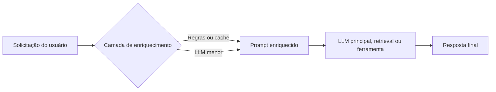
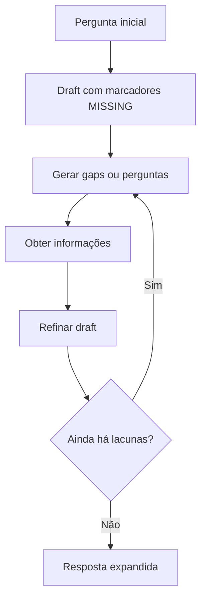

# Capítulo 6: Prompt Enriquecido

Este capítulo trata de duas frentes complementares:

- enriquecer a pergunta do usuário antes da execução;
- expandir iterativamente a resposta quando a primeira versão ainda está rasa.

O objetivo é reduzir ambiguidade, melhorar recuperação de contexto e aumentar a chance de acertar já na primeira interação. Na árvore atual do capítulo, os exemplos executáveis estão na raiz. Não existe uma pasta `examples/` neste diretório.

## Visão geral do capítulo

Quando um usuário faz uma pergunta vaga, incompleta ou mal formulada, a aplicação tende a gastar mais tempo, mais chamadas de modelo e mais tokens até chegar a uma resposta satisfatória. O enriquecimento do prompt existe justamente para atacar esse problema.

Em termos práticos, o capítulo mostra duas linhas de trabalho:

- reformular a entrada do usuário para deixá-la mais útil;
- usar iteração para preencher lacunas e ampliar a resposta.

## Mapa do capítulo na árvore atual

| Arquivo | Papel no capítulo | Observações |
| --- | --- | --- |
| `0-No-expansion.py` | Linha de base sem enriquecimento | Faz uma única chamada ao LLM e imprime a resposta. |
| `1-ITER_RETGEN.py` | Expansão iterativa de resposta | Usa marcadores `[MISSING: ...]`, gera gaps, preenche e expande. |
| `2-query-enrichment.py` | Enriquecimento interativo da pergunta | Coleta clarificações até formar uma query mais completa. |
| `prompt-enriquecido.md` | Material de estudo | Resume teoria e conecta com os arquivos reais. |

## Quando enriquecer um prompt

O enriquecimento é útil principalmente nestes cenários:

- Consulta vaga ou ambígua.
  Exemplo: `Python e LangChain`.
- Falta de contexto relevante.
  Exemplo: `Como criar uma API em Python?`
- Necessidade de controlar o formato da saída.
  Exemplo: pedir Markdown, JSON ou uma estrutura específica.
- Redução de risco de premissas incorretas.
  Exemplo: reescrever perguntas que já chegam com pressupostos errados.
- Personalização.
  Exemplo: adaptar a resposta ao perfil, linguagem dominante ou histórico do usuário.

Em todos esses casos, a lógica é a mesma: transformar uma pergunta fraca em uma entrada mais densa, específica e útil para o sistema.

## Fluxo básico de enriquecimento

Nem sempre a pergunta do usuário precisa ir diretamente para o modelo principal. Uma arquitetura comum insere uma camada intermediária responsável por enriquecer a solicitação antes da resposta final.



Pontos importantes:

- A camada de enriquecimento pode ser um LLM menor, mais barato e mais rápido.
- Em cenários repetitivos, regras, palavras-chave e cache podem substituir uma chamada extra de modelo.
- Cada chamada adicional aumenta custo e latência.
- Em aplicações com IA, arquitetura de prompts é parte da arquitetura do sistema.

## Técnicas teóricas abordadas

### Query2Doc

Query2Doc gera um mini-documento neutro a partir da pergunta do usuário para enriquecer a consulta antes da busca. A utilidade principal está em aumentar o vocabulário disponível para mecanismos de busca léxica, como BM25, Elastic ou Lucene.

Ideia central:

- o modelo não responde diretamente ao usuário;
- ele gera um texto auxiliar;
- esse texto é concatenado à pergunta original para melhorar a recuperação de documentos.

Esse material adicional deve ser informativo e neutro, porque serve como suporte para busca, não como resposta final.

### HyDE

HyDE significa `Hypothetical Document Embedding`. A lógica é parecida com Query2Doc, mas o objetivo muda: em vez de gerar um texto neutro para enriquecer vocabulário, gera-se um documento hipotético parecido com uma resposta real para apoiar busca semântica.

Nesse caso:

- o documento hipotético é usado para gerar embeddings;
- a busca acontece em um banco vetorial;
- a resposta final continua vindo da fonte de verdade recuperada, não do documento hipotético em si.

### Query2Doc vs HyDE

| Aspecto | Query2Doc | HyDE |
| --- | --- | --- |
| Foco principal | Busca léxica | Busca semântica |
| Tipo de texto gerado | Mini-documento neutro e explicativo | Resposta hipotética plausível |
| Uso típico | BM25, Elastic, Lucene | Vetores, embeddings, dense retrieval |
| Papel do texto gerado | Expandir vocabulário | Expandir contexto semântico |
| Vai para o usuário final? | Não deveria | Não deveria |

### ITER-RETGEN

ITER-RETGEN trabalha com um loop de geração e refinamento. Em vez de aceitar uma primeira resposta superficial, o sistema cria um rascunho com lacunas, transforma essas lacunas em novos pontos de investigação e volta ao texto para deixá-lo mais completo.

Fluxo conceitual:



Os quatro blocos didáticos apresentados na aula são:

- `Draft`: cria a primeira resposta com lacunas explícitas.
- `Query`: transforma lacunas em itens de investigação.
- `Fill`: preenche parte das lacunas com informações novas.
- `Expansion`: adiciona novas lacunas quando o resultado ficou curto demais.

## Relação entre teoria e implementação atual

Nem toda técnica discutida na aula virou um script dedicado neste capítulo. O estado atual da pasta é este:

| Conceito | Situação no capítulo atual |
| --- | --- |
| Enriquecimento de query | Implementado em `2-query-enrichment.py` |
| Expansão iterativa de resposta | Implementado em `1-ITER_RETGEN.py` |
| Linha de base sem enriquecimento | Implementado em `0-No-expansion.py` |
| Query2Doc | Conceito presente no material, sem script dedicado |
| HyDE | Conceito presente no material, sem script dedicado |
| Retrieval externo com Elastic, web ou banco vetorial | Conceito citado, sem integração real nos scripts atuais |

O ponto mais importante aqui é não confundir teoria com implementação. O código do capítulo é didático e simplifica vários aspectos.

## Exemplo 1: `0-No-expansion.py`

Este arquivo funciona como linha de base.

O que ele faz:

- carrega variáveis de ambiente com `load_dotenv()`;
- inicializa o modelo com `init_chat_model("openai:gpt-4o-mini", temperature=0.7)`;
- monta um `PromptTemplate` simples;
- executa a pergunta fixa `Explain about the LangChain and LangGraph`;
- imprime a resposta e o tamanho do texto retornado.

O valor pedagógico do arquivo está em mostrar o comportamento sem qualquer etapa de reformulação ou iteração.

## Exemplo 2: `1-ITER_RETGEN.py`

Este é o exemplo mais importante para expansão iterativa de resposta.

### Estrutura do script

O arquivo define quatro prompts:

- `draft_prompt`: gera um rascunho inicial com até cinco marcadores `[MISSING: ...]`.
- `query_prompt`: pede informações para preencher cada lacuna encontrada.
- `fill_prompt`: reescreve o texto substituindo de um a dois marcadores por iteração.
- `expansion_prompt`: adiciona novas lacunas quando a resposta fica completa cedo demais.

Depois, o script cria uma chain para cada prompt e usa a função `iter_retgen_multi()` para controlar o loop.

### O que a função principal faz

O fluxo de `iter_retgen_multi(question, max_iters=10, target_completeness=0.95)` é:

1. gerar um draft inicial;
2. contar quantos marcadores `[MISSING:` existem;
3. enquanto houver gaps ou espaço para expansão:
4. gerar perguntas a partir do draft;
5. preencher parte das lacunas;
6. medir progresso;
7. interromper se não houver avanço em três iterações seguidas.

### Ponto de atenção sobre a implementação atual

Conceitualmente, ITER-RETGEN costuma alternar entre geração e recuperação de informação. No script atual, a etapa de recuperação não está integrada a uma fonte externa real. Em vez disso, o próprio LLM gera as informações usadas no preenchimento.

Em outras palavras:

- a teoria fala em retrieval;
- o código atual demonstra a mecânica do loop;
- mas a recuperação está simulada por novas chamadas ao modelo.

Isso não invalida o exemplo. Apenas mostra que ele é uma simplificação didática, e não uma implementação completa de retrieval externo.

### Observações úteis

- O script é propositalmente verboso para facilitar debug e acompanhamento da execução.
- O parâmetro `target_completeness` existe na assinatura, mas o encerramento prático depende do número de gaps e da falta de progresso.
- Como há múltiplas chamadas ao LLM, custo e latência crescem rapidamente.

## Exemplo 3: `2-query-enrichment.py`

Este arquivo demonstra enriquecimento interativo da pergunta do usuário.

### Ideia central

O cenário didático é revisão de pull request. A pergunta original pode vir vaga, como `Review my PR`. O sistema então pede clarificações até reunir contexto suficiente para montar uma pergunta muito mais específica.

### Componentes principais

- `EnrichmentConfig`: define modelo, temperatura, número máximo de rodadas e a lista de informações obrigatórias.
- `EnrichedQuery`: modelo Pydantic com `is_complex`, `sub_queries`, `clarifications` e `entities`.
- `QueryEnricher`: cria uma chain para estruturar a análise em JSON e outra para reescrever a pergunta em linguagem natural.
- `EnrichmentSession`: faz o loop interativo com o usuário.
- `QueryEnrichmentApp`: ponto de entrada da aplicação.

### Informações obrigatórias no exemplo atual

O script exige seis campos para o cenário de revisão de PR:

- PR ID
- repository
- branch
- concerns
- style guide
- test requirements

Enquanto esses campos não forem fornecidos explicitamente, o sistema continua gerando clarificações.

### Como o fluxo funciona

1. o usuário entra com uma pergunta inicial;
2. o LLM devolve um JSON com lacunas e entidades identificadas;
3. a sessão coleta respostas do usuário;
4. a pergunta é reconstruída com o contexto acumulado;
5. ao final, o sistema gera uma versão final em linguagem natural.

### Ponto de atenção sobre o exemplo

O script ilustra bem a técnica, mas ainda é um exemplo local e autocontido:

- não consulta um sistema real de pull requests;
- não aciona ferramentas externas;
- não executa a revisão propriamente dita;
- apenas transforma a pergunta em uma query melhor.

Outro detalhe prático: o prompt e as mensagens de terminal do script estão em inglês, mesmo que a explicação conceitual aqui esteja em pt-BR.

## Comandos atuais do capítulo

Os comandos que correspondem aos arquivos reais desta pasta são:

```bash
python .\0-No-expansion.py
python .\1-ITER_RETGEN.py
python .\2-query-enrichment.py
```

Para executar os exemplos, você precisa de `OPENAI_API_KEY` disponível no ambiente.

## Síntese para revisão

- Enriquecer pergunta e expandir resposta são técnicas diferentes.
- Mais contexto tende a melhorar resposta e recuperação, mas aumenta custo e latência.
- Nem todo enriquecimento precisa de LLM; regras e cache também podem resolver parte do problema.
- Query2Doc e HyDE aparecem como base conceitual para retrieval, mesmo sem script dedicado neste capítulo.
- `1-ITER_RETGEN.py` mostra o loop de refinamento, mas sem retrieval externo real.
- `2-query-enrichment.py` mostra como transformar uma solicitação vaga em uma pergunta operacionalizável.
